# SiaraBot @siara 

*A Slack bot that **brings fun and joy to your everyday slack's communication**.*

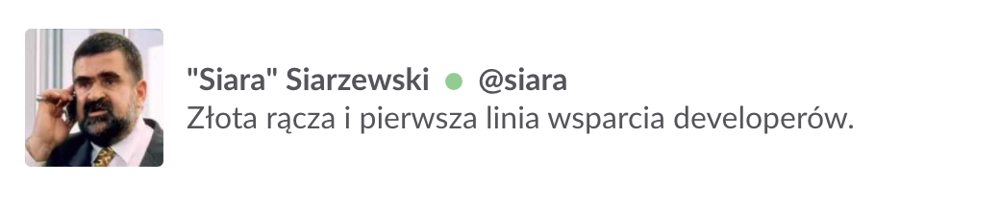


## Description
**SiaraBot** was designed to bring joy and fun into Slack's channels conversations. Depending on the situation.
"Siara" **welcomes, motivates, amuses, teaches or blames** team members. He also reminds about **standup meeting** and **code-reviews**. Siara supports and enforces now Firebase connection - all configurable options are stored in the real 
-time firebase database. 
**@siara** is a Node.js bot based on polish comedy movie "Kiler" character - **Stefan "Siara" Siarzewski**. 


## **Top features:**

- ### Reminds devs about stand-up time (with optional video url)
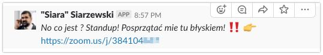

- ### Reminds devs to make a code-review
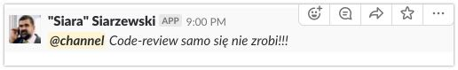

- ### To motivate someone (type "!brawo"):
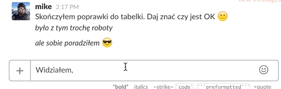

- ### To blame someone (type "!chmurka"):
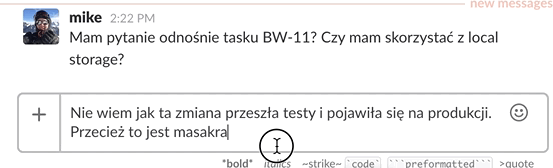

- ### To find "missing" teammate (type "!gdzie @teammate"):
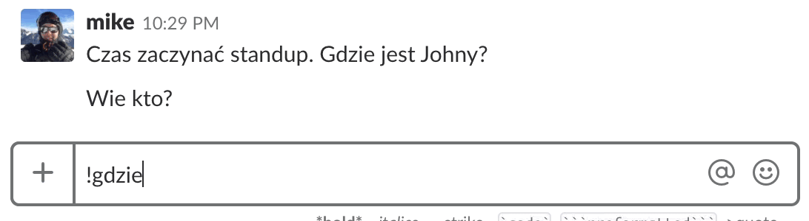

- ### To welcome someone (type "!dziendobry"):
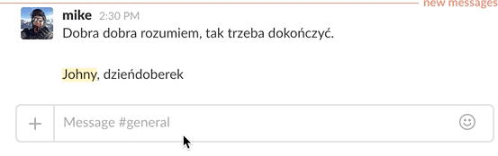


## How to run SiaraBot?


**1. Clone repository:**

```
git clone https://github.com/michaelmoney/SiaraBot.git
```

**2. Install all dependencies via NPM:**

```
npm install
```

**NOTE: Current version of SiaraBot uses ES6 features and async/await. Node version  7.6.x is required.**

**3. Create a new Firebase database and setup initial keys/values :**

3.1 Import `siara-export.json` to your newly created Firebase database. You can edit values later.

- **weekdays** - Prevent from running schedule tasks during weekends.
- **holidays** - Prevent from running schedule tasks on specific date(s). 
- **locale** - Setup locale for MomentJS. Feature has _Work-In-Progress_ status.
- **phrases (command list and texts)** - Define your own funny command and texts.
 
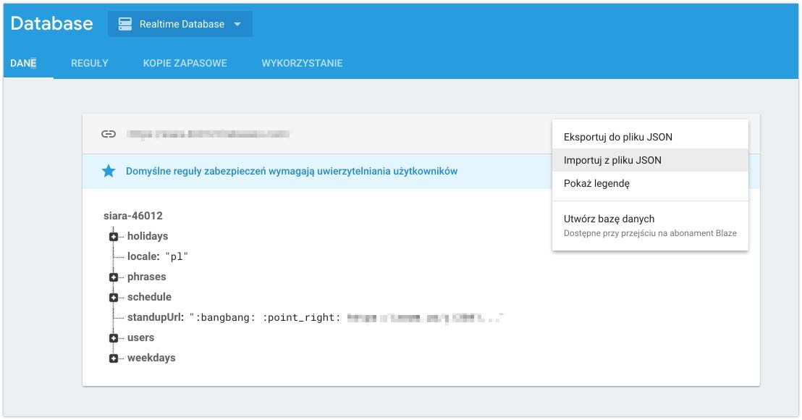


**4. Setup all environment variables:**

4.1 You can manually export all environment variables by running in terminal:
```
export BOT_TOKEN=YOUR_SLACK_TOKEN
```
4.2 Create `.env` file in root directory and define inside all variables. 
```
    FIREBASE_PASS: YOUR_VARIABLE
    FIREBASE_EMAIL: YOUR_VARIABLE
    FIREBASE_API_KEY: YOUR_VARIABLE
    FIREBASE_AUTHDOMAIN: YOUR_VARIABLE
    FIREBASE_DB_URL: YOUR_VARIABLE
    FIREBASE_STORAGE_BUCKET: YOUR_VARIABLE
    BOT_TOKEN: YOUR_VARIABLE
```


**5. Run SiaraBot:**

```
npm start
```

## Can I customise SiaraBot?

### 1.Can I add my own commands (phrases) and texts? 

Yes. SiaraBot's texts can be easily extended and modified by changing database's **"phrases"** key value. All texts are stored in **"text"** array. Just update it.

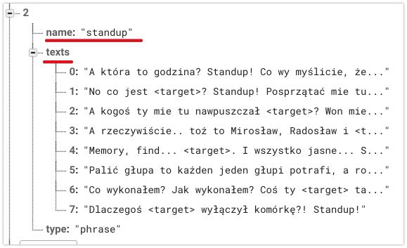


### 2.Can I use different name and different avatar icon for SiaraBot?
Yes. You setup different name, for example **SuperManBot** and upload different avatar icon.

## How to print all available phrases?

**In the Slack's message input, type:**

```
!help
``` 

## Supported commands (keywords):
- spadam
- zmiana
- standup
- chmurka
- tonieja
- dzieki
- cr
- pomylka
- kilim
- ufam
- lunch
- gdzie
- zarobiony
- doroboty
- pytanie
- idziemy
- cycki
- dziendobry
- niewiem
- n
- brawo
- piwo
- wow

## Where to deploy SiaraBot?
SiaraBot could be run on any Node web server. It's very easy to deploy and use SiaraBot on following cloud platforms:
- Heroku
- Amazon Web Services (AWS)
- any node server > 7 (async / await)

## How to add SiaraBot into my Slack team?
If you have already deployed SiaraBot  and have an instance running (`npm start`) it's very simple.
In your Slack settings, you need to create a new bot and retrieve a token.

To add a  new bot please read following description:
https://api.slack.com/bot-users

To keep your token safe (outside repo), `SiaraBot` load token from the ENV variable.

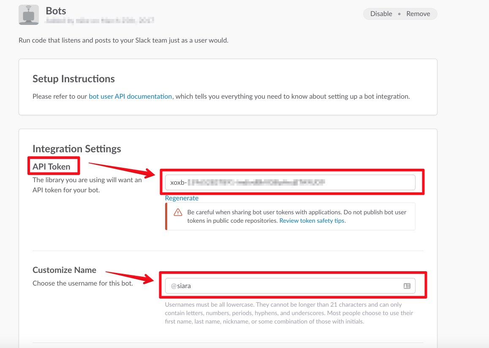
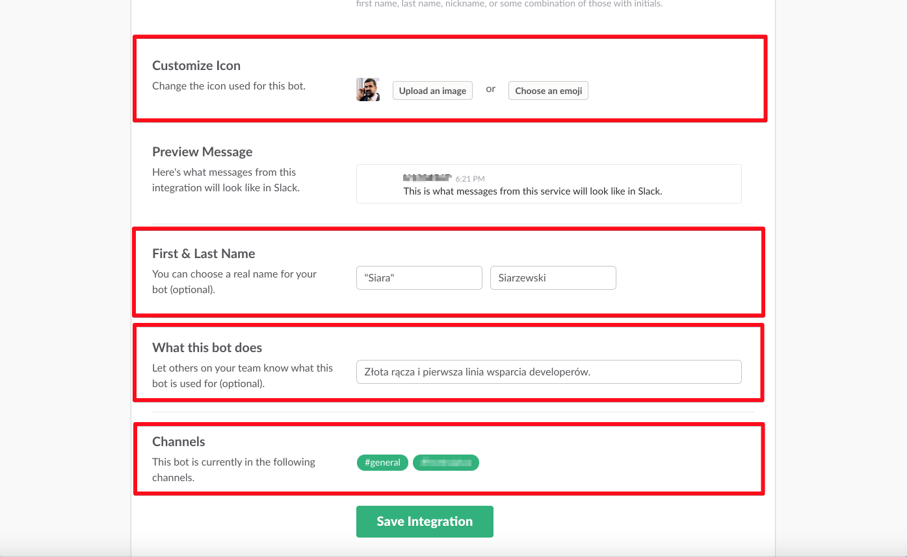


## Example of usage SiaraBot

### How to print all available phrases?

To see all available phrases, type:

```
!help
``` 

### SiaraBot example commands and texts

Inside Slack window type a command beginning with "!", optionally adding `@user` at the end of command:

**To motivate someone:**
```
!doroboty @user
``` 
**Outputs:** 
```

Od tej pory, @user masz mieć w dupie paragrafy! Masz być jak bulterier! Jak wściekły byk!
Jak Tommy Lee Jones w Ściganym!
```

**To ask someone "where have you been?":**

```
!gdzie @user
``` 
**Outputs:** 

```
@user Gdzieś była, lafiryndo?
```

**To praise someone:**

```
!brawo
``` 
**Outputs:**

```
Ty wiesz kto to jest? Ty wiesz kto to jest?! To jest @user! On se może jeść Chateau, może se jeść ostrygę, może se jeść co chce,
a nie twoje rozpaćkane kanapki!
```

**To welcome someone:**

```
!dziendobry
``` 

**Outputs:** 

```
Dzień dobry Panie Komisarzu
```

**To blame somebody:**

```
!kilim @user
``` 

**Outputs:**
```
Jako pragmatyk i realista, przedkładam interes ponad osobiste porachunki,
dlatego nie zabiłem Cię, @user chociaż powinienem.
```

### Links:
- "Kiler" movie https://en.wikipedia.org/wiki/Kiler
- "pmxbot" https://github.com/yougov/pmxbot/tree/master/pmxbot
